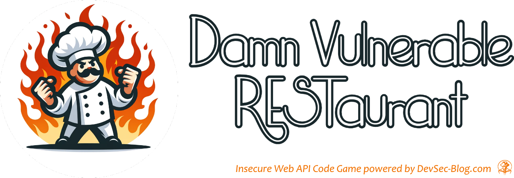
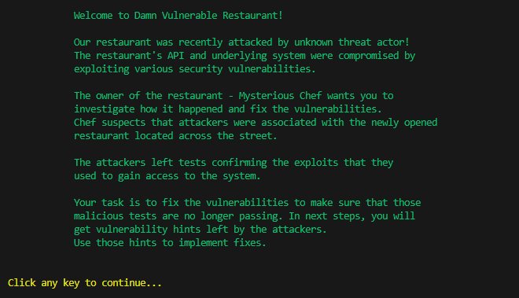

An intentionally vulnerable API service designed for learning and training purposes dedicated to developers, ethical hackers and security engineers. The idea of the project is to provide an environment that can be easily extended with new vulnerable endpoints and mechanisms that could be used in trainings for detecting and exploiting identified vulnerabilities.

It's a training playground: 

* **For Developers** - engage in a dedicated game where you will identify and fix vulnerabilities interactively. 
* **For Ethical Hackers** - exploit vulnerabilities manually or use automated tools. Treat it as a CTF challenge, you can start from low privileged API user and escalate to root user. There is one path to achieve this. API docs are provided to facilitate your hacking adventure.
* **For Security Engineers** - utilise various security automation tools such as SAST, DAST, IaC, etc., to test vulnerability detection mechanisms.

## 🏆 Hall of Fame
Participants who were able to complete this challenge are listed in [Hall of Fame](HALL_OF_FAME.md). Submit your solution and become one of them!

## 🚀 Starting the Game

The application can be launched locally in two alternative ways: **Developers** can play an interactive game where they will investigate and fix vulnerabilities, or **Ethical Hackers** can identify and exploit vulnerabilities. Furthermore, [GitHub Codespaces](https://github.com/features/codespaces) can be used to run the application easily without a local environment! GitHub Codespaces offers up to 60 hours a month for free.

The following sections present how to start the game.

### 👨‍💻 Developers Approach

For developers, I created a dedicated game where you can identify and fix vulnerabilities in FastAPI based app in an interactive way.

1. Install [Docker](https://www.docker.com/get-started/) and [Docker Compose V2](https://docs.docker.com/compose/install/).

2. Start the game by executing the following commands:
```sh
git clone https://github.com/theowni/Damn-Vulnerable-RESTaurant-API-Game.git
cd Damn-Vulnerable-RESTaurant-API-Game
./start_game.sh
```
3. You should observe the following screen:


4. You can implement the fixes without needing to restart the Docker instance. Since changes to models are not required, there should be no need for restarts related to migrations.

At this point, the application is running locally. You can take a look at **step 3** in next section for more details about accessing the API and documentation.

### 👾 Ethical Hackers Approach

You can open RESTaurant easily just with a few steps, you don't need to have a large budget, rented place, cooks or waitress...

You just need to find a Chef and follow the steps:

1. Install [Docker](https://www.docker.com/get-started/) and [Docker Compose V2](https://docs.docker.com/compose/install/).

2. Deploy RESTaurant locally with Docker by executing the following commands:

    ```sh
    git clone https://github.com/CYBER-WARRIOR-SEC/-Game-API-Rentan-RESTaurant-Sialan
    cd Damn-Vulnerable-RESTaurant-API-Game
    ./start_app.sh
    ```

3. The API service will be exposed at [http://localhost:8080](http://localhost:8080) by default. API documentation can be found at the following endpoints:
 * Swagger - [http://localhost:8080/docs](http://localhost:8080/docs)
 * Redoc - [http://localhost:8080/redoc](http://localhost:8080/redoc)

4. To close the restaurant at the end of the hacking day, just run:
```
./stop_app.sh
```
Data will persist between stops and starts.

You're ready to serve the dishes now, **make the Chef mad by exploiting vulns** or **make the Chef happy by fixing them**!

### ☁️ Launch in Github Codespaces

To launch the game in [GitHub Codespaces](https://github.com/features/codespaces), follow the steps:
1. Click on:
[](https://github.com/new?template_owner=theowni&template_name=Damn-Vulnerable-RESTaurant-API-Game&owner=%40me&name=Damn-Vulnerable-RESTaurant-API-Game&description=My+clone+of+Damn+Vulnerable+RESTaurant+API+Game&visibility=public)

2. To create a codespace, click the **Code** green drop down button in the upper-right of your repository navigation bar.
3. Click the **Create codespace on main**.
4. After creating a codespace, you can execute `./start_game.sh` or `./start_app.sh` respectively in the terminal and follow instructions presented in previous sections.
5. The application can be accessed via a dedicated link. Example codespace environment is shown below (take a look at web app URL scheme): 


## 🛠️ Development Stack

It is developed with Python FastAPI framework and uses PostgreSQL database. The environment is containerised and can be easily deployed locally with Docker. With Python and FastAPI it's rather simple to extend the application with new vulnerable features in a short amount of time.

Damn Vulnerable RESTaurant is not actually limited to any specific type of API, as endpoints may utilize REST API, GraphQL, and others. It's a restaurant, so various dishes might be served there over a time!

## 🗺️ Roadmap

There are several ideas for improving the project such as:

- [x] more user-friendly developer's environment with GitHub Codespaces
- [ ] adding learning resources to each vulnerability to help in better understanding vulns
- [ ] implementing more vulnerabilities
- [ ] ideas based on feedback / issues raised in repository

## 🤝 Development / Contribution

Damn Vulnerable RESTaurant was developed with having flexibility in mind. It can be extended with new security issues by following [CONTRIBUTING.md](CONTRIBUTING.md).

## ⚠️ Warning and Disclaimer!
Damn Vulnerable RESTaurant is damn vulnerable! Do not serve dishes from this RESTaurant on a public streets... ekhm... networks!

Do not upload it to your hosting provider's public html folder or any Internet facing servers, as they will be compromised. It is recommended to deploy RESTaurant locally with Docker.

The usage of the Damn Vulnerable RESTaurant application, which is intentionally insecure by design, is at your own risk. We do not assume any responsibility for any potential harm, damage, or security breaches that may arise from using RESTaurant. This application is specifically created for educational and training purposes within controlled environments, such as learning about vulnerabilities and practicing ethical hacking techniques. It is RESTaurant to use RESTaurant responsibly and exclusively in environments that you have the right to access and modify. By using RESTaurant, you acknowledge that any unintended usage or consequences are your sole responsibility, and we disclaim liability for any such actions.

## 🧾 License

Damn Vulnerable RESTaurant is proudly developed under the terms of the GNU General Public License version 3.0 (GNU GPL v3.0). This license empowers the open-source community by promoting the principles of software freedom, collaboration, and transparency. With GNU GPL v3.0, RESTaurant encourages learning, sharing, and contributions from ethical hackers, security engineers, and developers to collectively enhance their skills and understanding of security vulnerabilities. Please review the LICENSE file for a detailed overview of the rights and responsibilities associated with using and contributing to this project.
